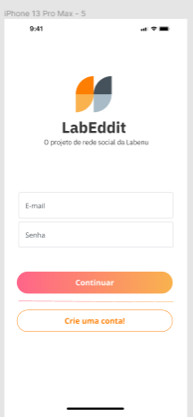
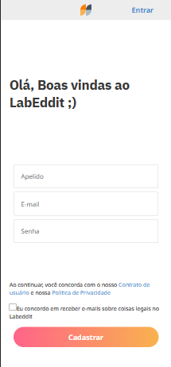
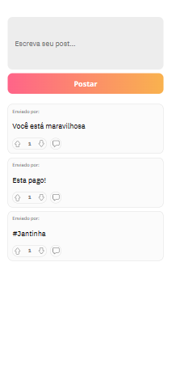

# LabEddit
O projeto de rede social da Labenu

#
# Labeddit Full Stack
O **Labeddit** é uma rede social com o objetivo de promover a conexão e interação entre pessoas. Quem se cadastrar no aplicativo poderá criar e curtir e comentar publicações.

Desenvolvido no Bootcamp da Labenu para utilizar todo o conhecimento adquirido em back-end e front-end.

Foi seguido o modelo do Figma abaixo um design de app mobile first:
[Clique aqui!](https://www.figma.com/file/Byakv89sjTqI6NG2NRAAKJ/Projeto-Integrador-Labeddit?node-id=0%3A1&t=haX9j5M0lHbjWnAr-0)

- Mobile First é um conceito aplicado em projetos web onde o foco inicial da arquitetura e desenvolvimento é direcionado aos dispositivos móveis, ou seja, seu layout e funcionalidades são desenvolvidos primeiramente para a tela do celular e a partir disso (se necessário) adaptado para telas maiores, como dos tablets ou desktops. 

Crie repositórios pessoais separados para o front e para o back, pois facilita o processo de deploy.

## 🔗Link de Acesso
* *Visualize o site:* [Clique aqui!]( https://labeddit-aureana.surge.sh/)
* *Veja a documentação do projeto Labeddit-Back-end (POSTMAN):* [Clique aqui!](https://documenter.getpostman.com/view/24460719/2s93JxsMJg)
* *Acesso ao repositório Labeddit-Back-End:* [Clique aqui!](https://github.com/Aureana/LabEddit-back.git)

## Stack utilizada: Front-end: 
* React JS

### Bibliotecas utilizadas
* styled-components
* axios
* react-router-dom

## Executando o Projeto
* npm install: Instalar as dependências listadas no package.json;
* npm start: Para iniciar a aplicação

## 🚀 Sobre mim
 *Olá, me chamo Aureana!👋 Eu sou uma pessoa desenvolvedora full-stack, apaixonada por tecnologia!* 😊

 💖💖💖*Designed and built by Aureana with Love & Coffee*💖💖💖
#
#
## 📫 Contato

*E-mail: aureana2018@outlook.com*
#
## 🔗 Links

